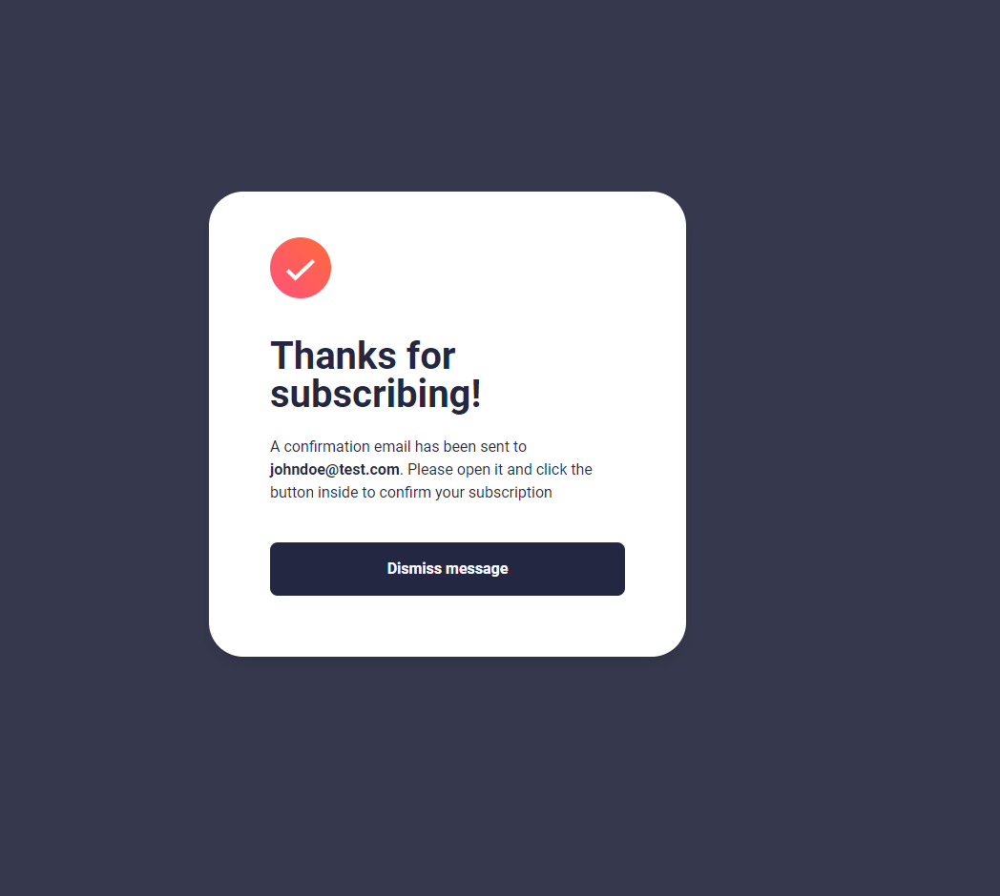

# Frontend Mentor - Newsletter sign-up form with success message solution

This is a solution to the [Newsletter sign-up form with success message challenge on Frontend Mentor](https://www.frontendmentor.io/challenges/newsletter-signup-form-with-success-message-3FC1AZbNrv). Frontend Mentor challenges help you improve your coding skills by building realistic projects.

## Table of contents

- [Overview](#overview)
  - [The challenge](#the-challenge)
  - [Screenshot](#screenshot)
  - [Links](#links)
- [My process](#my-process)
  - [Built with](#built-with)
  - [What I learned](#what-i-learned)
  - [Continued development](#continued-development)
  - [Useful resources](#useful-resources)
- [Author](#author)

## Overview

### The challenge

Users should be able to:

- Add their email and submit the form
- See a success message with their email after successfully submitting the form
- See form validation messages if:
  - The field is left empty
  - The email address is not formatted correctly
- View the optimal layout for the interface depending on their device's screen size
- See hover and focus states for all interactive elements on the page

### Screenshot




### Links

- Solution URL: [Add solution URL here](https://your-solution-url.com)
- Live Site URL: [Add live site URL here](https://your-live-site-url.com)

## My process

### Built with

- Semantic HTML5 markup
- Flexbox
- Mobile-first workflow
- Vite Bundler
- Tailwindcss
- Javascript

### What I learned

This project has two static pages. I countered the issue of passing the user email, which has been entered for the success page. I solved it by using the local storage, as shown below. In addition, for validating the user-entered email, I used regex patterns.

```js
const emailRegex = /\b[A-Za-z0-9._%+-]+@[A-Za-z0-9.-]+\.[A-Za-z]{2,}\b/;

  if (!emailRegex.test(email)) {
    emailError.classList.remove('hidden');
    input.classList.remove(
      'border-grey',
      'focus:border-darkNavy',
      'focus:outline-darkNavy'
    );
```

```js
localStorage.setItem('userEmail', email);
```

The other thing I learned during this project was how to set a vite with vanilla javascript to redirect the user to the success page upon entering a valid email.

```js
window.location.href = 'success.html';
```

Lastly, I encountered an issue with classes being added to the HTML by my main.js file for dynamic validation. This issue helped me realize that for them to work, I have to define my js file path in the tailwind.config.js file as below:

```js
content: ['./*.html', './public/js/*.js'],
```

### Continued development

So far, the project serves its mentioned purposes, but it can be optimized for tablet-size screens. It has a great responsive design for mobile and desktop, but since the card width is 900 px, it is not well designed for tablet-size screens between 680 px and 768 px.

### Useful resources

- [Discussion for the tailwind issue](https://github.com/tailwindlabs/tailwindcss/discussions/7633) - I found the issue regarding the classes added by the js file.

## Author

- Github - [Amir Taherian](https://github.com/Amirat9)
- Frontend Mentor - [@amirat9](https://www.frontendmentor.io/profile/Amirat9)
